# Parcial AREP tercio 2

Para este parcial se nos pidió desarrollar un servidor proxy que mediante el algoritmo de round-robin delegara peticiones a 2 servicios diferentes, en este caso MathServices1 y MathServices2.

# Arquitectura


# Como ejecutar
Para ejecutar se deben tener 3 instancias EC2 en total, 2 de estas serán los math services que serán idénticos, es decir que muestran los mismos servicios. La otra instancia deberá ser el proxy, el cual redirige las peticiones mediante round robin.

Las 3 instancias deberán tener instalados los siguientes paquetes: `maven` y `git`

Para instalarlos usamos los comandos
```bash
sudo yum install maven
```

```bash
sudo yum install git
```
respectivamente.

Una vez tengamos instalados los paquetes debemos clonar el repositorio de git:

```bash
https://github.com/Sebs2807/parcial-AREP-2.gitgit clone https://github.com/Sebs2807/parcial-AREP-2.git
```

Nos dirigimos a la carpeta que vaya a ejecutar esa instancia, en el caso del proxy hacemos `cd proxy/` y en el caso de las instancias para math services hacemos `cd collatz/`, una vez estemos dentro de la carpeta generaremos el jar para ejecutar, esto se hace usando el comando `mvn clean package`, veremos que se generó un jar dentro de la carpeta target, entonces haremos el comando `java -jar target/[ejecutable]` y ya quedará corriendo, por último para verificar que todo está bien vamos a la ip que nos haya dado la instancia del proxy y pondremos el puerto en el que se esté ejecutando, deberíamos ver el formulario como a continuación.

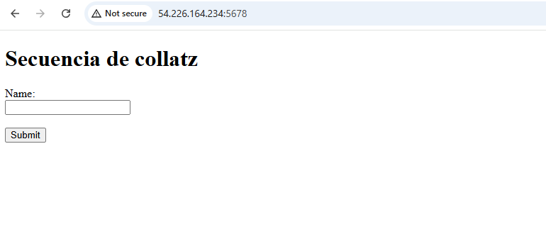

Si se quiere ejecutar localmente basta con ejecutar las clases principales de tanto el proxy como del collatz

# Pruebas
- Código para redirección mediante el proxy usando el algoritmo round-robin a las 2 instancias EC2
Para esto se usó una variable atómica que actúa como comtador, se uso atómica por si se hacen peticiones a la vez, y la variable por cada petición aumenta en 1. Si la variable es par, entra al servidor 1, de lo contrario, entra al servidor 2
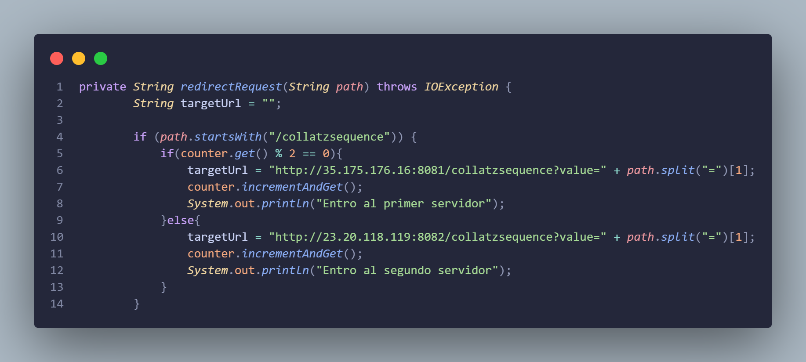
- Pruebas de que entra a los 2 servidores después de hacer varias peticiones
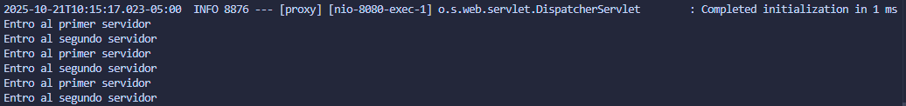
- Código para desarrollar el servicio de secuencia de collatz
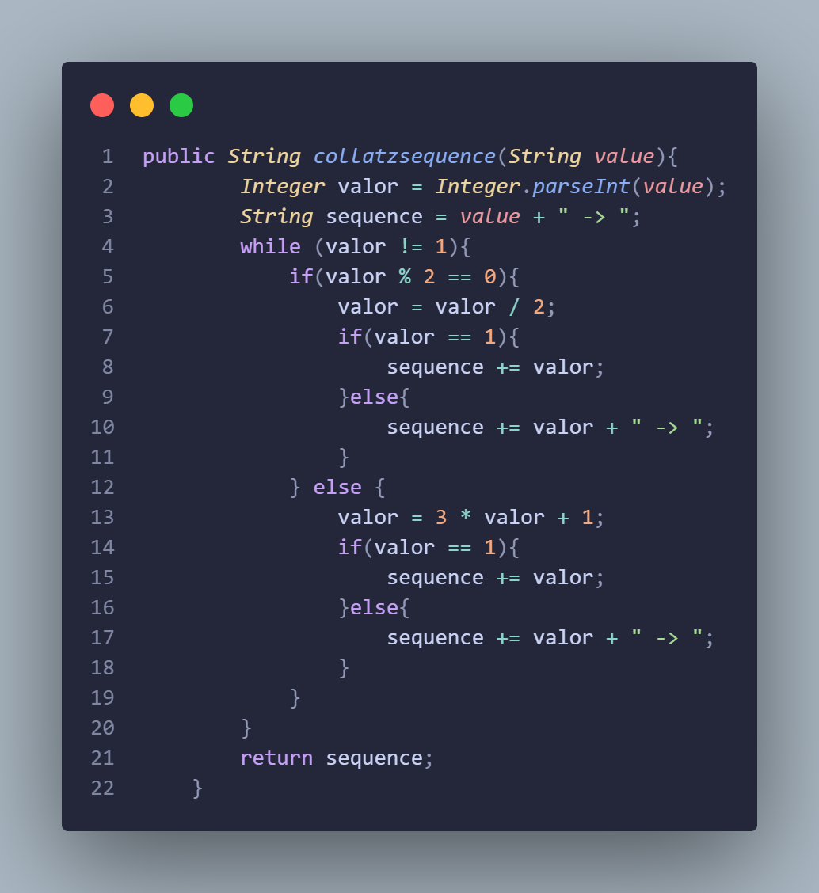
- Prueba de ejecución correcta del ejercicio de collatz
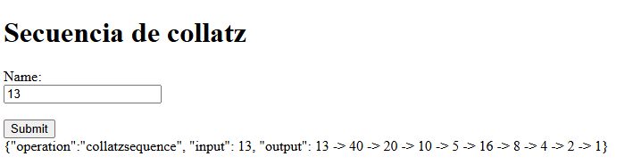

- Intancias creadas y en ejecución
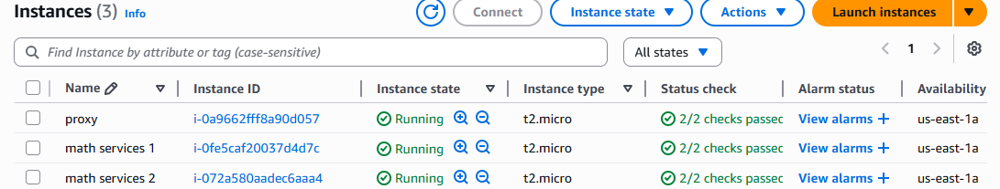
- Ejecución en las instancias
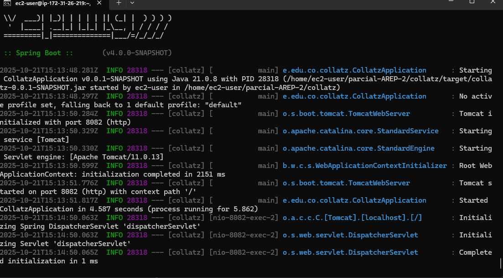
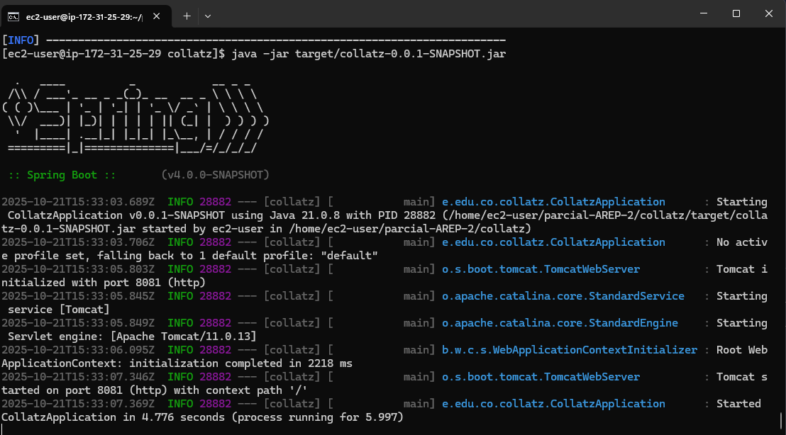
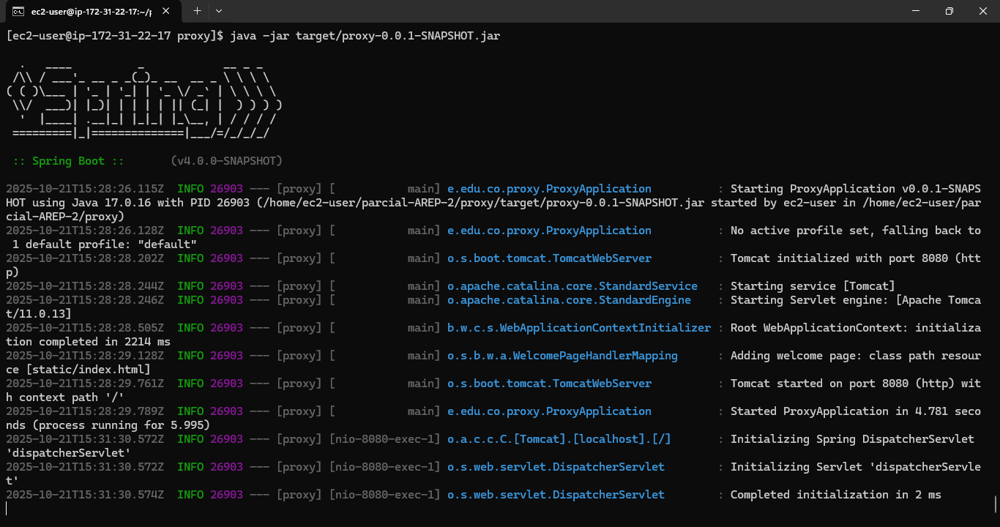

- Prueba de ejecución de las secuencias de collatz en la instancia del proxy EC2
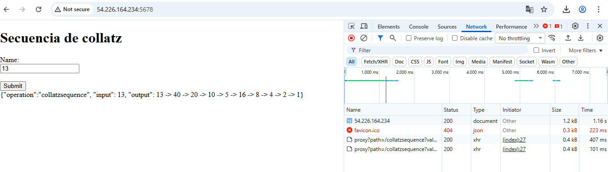

- Pruebas con números diferentes
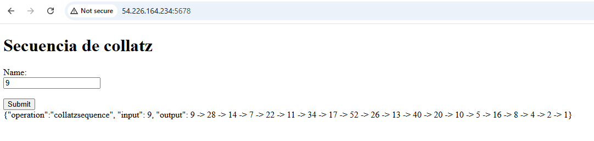
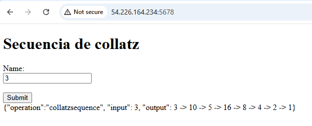
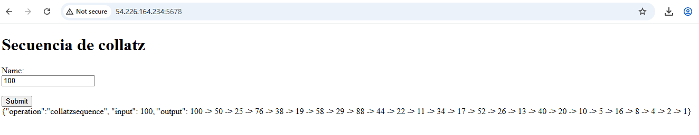
# Video
[El video también se encuentra subido al repositorio en la carpeta images](https://drive.google.com/file/d/105_Fi4kxhW4LzPxiRi_9-0bEpYgGwA38/view?usp=sharing)

https://drive.google.com/file/d/105_Fi4kxhW4LzPxiRi_9-0bEpYgGwA38/view?usp=sharing
